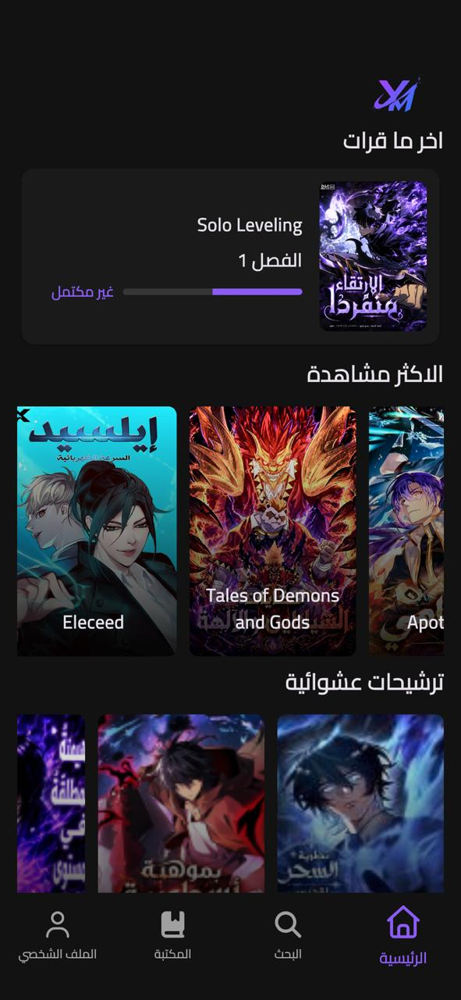
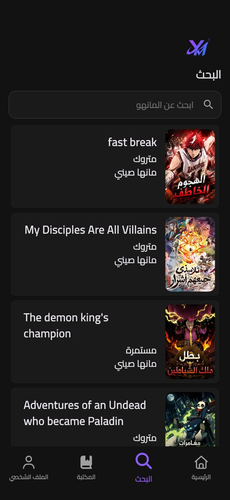
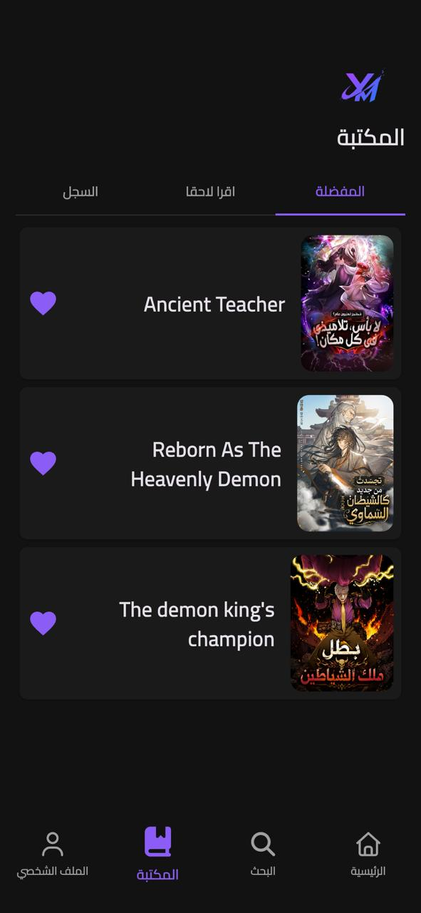
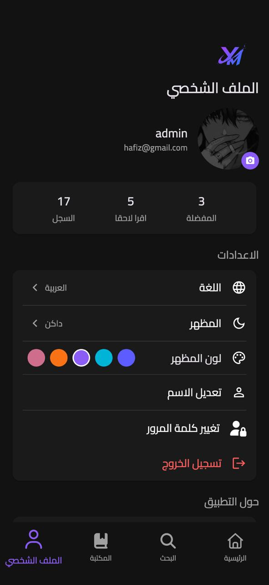

# yallaManwha

**The fastest, most beautiful manga · manhua · manhwa reader.**

---

## 📸 Screenshots

| Home | Search | Library | Profile |
|------|--------|---------|---------|
|  |  |  |  |

---

## ✨ Features

### 📖 Perfect Reading Experience
- **Lightning-Fast Loading** — Images are cached so pages load instantly, even offline.
- **Smart Chapter Tracker** — Always know which chapter you're on and what's next.
- **Quick Swipe Gestures** — Accidentally marked a chapter as read? Swipe to undo it instantly.

### 🌍 Multi-Language Support
- Switch the app interface to your preferred language with a single tap.
- Your language choice is remembered across sessions.

### 🌓 Dark & Light Mode
- A beautiful dark theme designed for late-night reading sessions.
- A crisp light theme for daytime reading.
- Your theme preference is saved automatically.

### ⚡ Always Up to Date
- **OTA Updates** — Hotfixes and minor improvements are delivered instantly in the background, no App Store update required.
- Performance tuning, lower memory usage, and improved crash protection.
